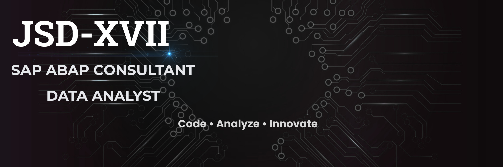

<!-- Banner Image (Replace repo path if needed) -->

  

<!-- Typing Animation Header -->

 

<!-- Top Quick Action Badges -->

  
  
  

 

---

### ✦ Executive Overview ✦

> **Jashaswi Dhal** — Enterprise Software Consultant specializing in modern **SAP ABAP Cloud**, **RAP (RESTful Application Programming)**, and **Data Analytics**. I bridge the gap between core enterprise SAP systems and intelligent data insights, delivering scalable solutions using CDS Views, OData V4, and Python analytics frameworks.

 

| 🎯 Primary Focus | 💼 Key Domain | 📍 Location |
| :--- | :--- | :--- |
| SAP ABAP Cloud & Data Analytics | Enterprise Applications & Data Visualization | Open to Global / Hybrid |

 

---

### ✦ Technical Stack & Expertise ✦

 

<!-- SAP Core Stack -->

  
  
  
  
  
  

<!-- Data Analytics & Tools -->

  
  
  
  
  

 

---

### ✦ Certifications & Verification ✦

 

<!-- Add actual Credly badge URLs here -->

  
  
  

 

---

### ✦ Featured Portfolio Projects ✦

 

| Project | Stack | Focus & Business Impact |
| :--- | :--- | :--- |
| **[Campus Lost & Found Tracker](https://github.com/JSD-XVII)** | SAP RAP, ABAP Cloud, Fiori Elements, OData V4 | Built an end-to-end modern enterprise application using SAP RAP architecture and CDS modeling with automated tracking UI. |
| **[Vendor Master Approval Workflow](https://github.com/JSD-XVII)** | ABAP Cloud, Business Events, Fiori | Streamlined vendor approval processes by designing event-driven workflow automation in S/4HANA environments. |
| **[Uber Ride Data Analysis](https://github.com/JSD-XVII)** | Python, Pandas, Seaborn, Power BI | Analyzed large-scale trip datasets to deliver actionable operational insights, peak-demand heatmaps, and dynamic KPI dashboards. |
| **[Meteorological Weather Data Web App](https://github.com/JSD-XVII)** | JavaScript, HTML5/CSS3, Open APIs | Interactive weather dashboard delivering real-time telemetry visual analytics and dynamic mapping. |

 

---

### ✦ GitHub Activity & Insights ✦

 

  
  

 

---

  ✦ Driven by Enterprise Innovation & Precision Engineering ✦

  

